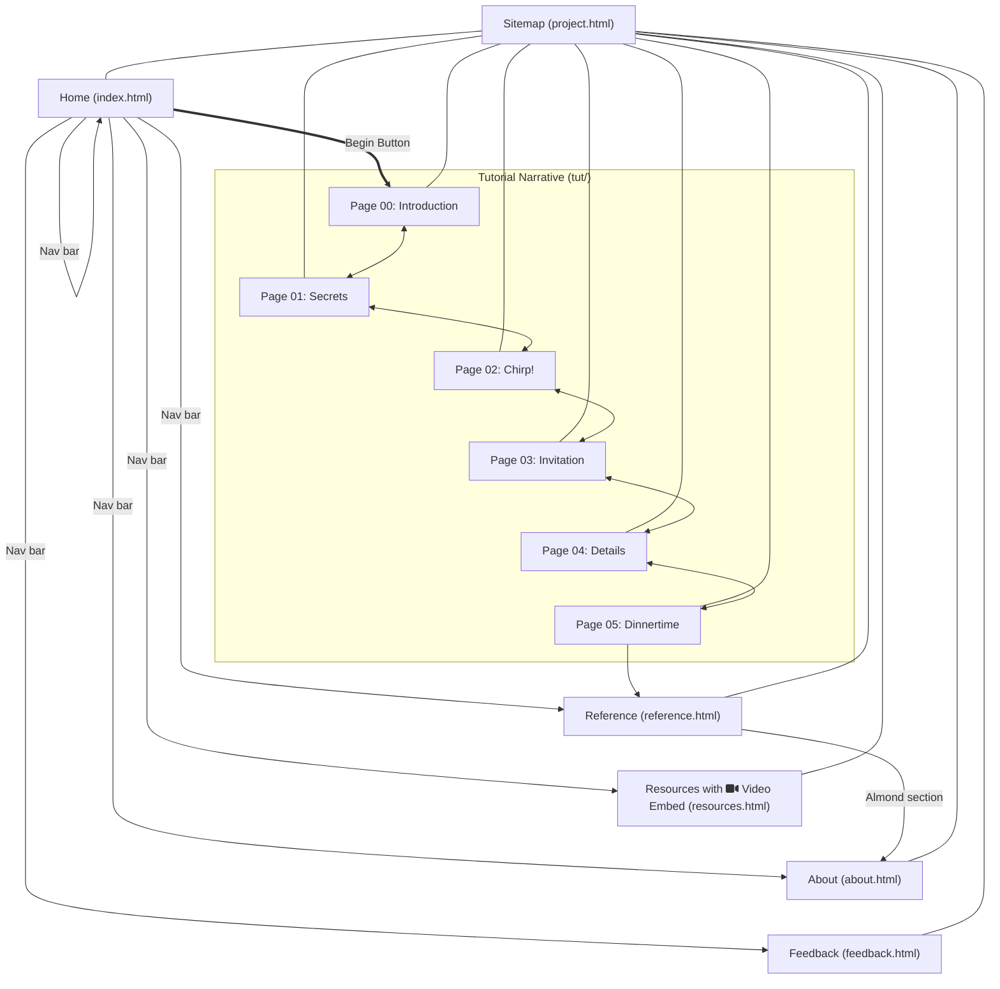

# everything110

[**Everything Is An Object**](https://almondjoycam.github.io/everything110/index.html): A website providing a narrative based on concepts of object-
oriented programming in natural language that will be familiar to children around the ages of 8-12 years.

---

## To Do List

- [x] Reference page is updated with overrides and inherited methods
- [ ] Not really sure what to do about the feedback form.
- Tutorial-specific layout:
    - Using grid will not be mobile-friendly
    - [ ] Add `p` classes as follows: `narration` and `dialogue`
    - [ ] Make sure `narration` is styled with `clear: both;`
    - [ ] Use `nth-of-type` to align `img` and `dialogue` alternately
- [ ] I haven't aligned a lot of images
- [x] The current section is highlighted in the nav bar

## ITD 110 Final Project Information

- [x] All code written using [Kate](https://kate-editor.org/), a text editor developed by the KDE community
- [x] Published (using GitHub Pages) to [Everything Is An Object!](https://almondjoycam.github.io/everything110/index.html)
- [x] Home page for the site
    - There is a `project.html` that is currently representing the sitemap.
    - The homepage needs to be `index.html` to work with GitHub pages, but all parts of the site can be accessed through `project.html`.
- [x] At least 6 webpages
- [ ] Each page has at least 250 words of text
- [x] Original work
- [x] At least 6 images (in the `img` folder, created by me)
- [x] One video: YouTube embed on `resources.html`
- [x] `meta` tags on each page
- [ ] Working form with 4-5 types of elements
    - I have a form with 3 types of elements but I need to add a few more. Also it doesn't work yet.
- [x] One page that uses tables effectively: `reference.html`
- Links:
    - [ ] One email
    - [x] One link to an **external website**: `resources.html`
    - [x] One link **within** the website: `reference.html`
    - [x] Consistent **navbar** on all pages
- [x] Consistent header with logo
- [x] Consistent footer on all pages
- [x] One external style sheet
- [x] Responsive to multiple screen widths
- [ ] W3C standards
- [x] Proper indentation

## Sitemap

